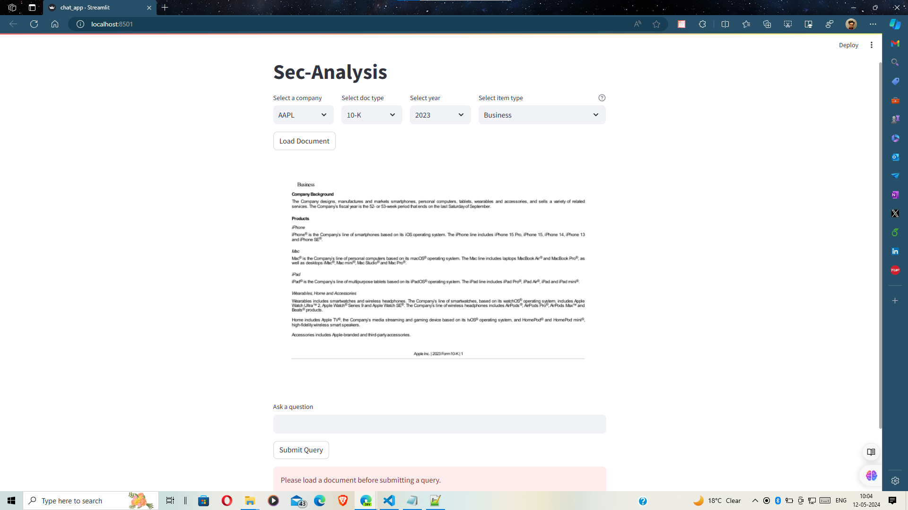

# SEC_Analytics

## Update under process  
## Structure and integration 
## 1-2 more iterations Pending

### Noticed the mail today only, so my progress is as follows:
May 10th: Focused on refining the conversational aspect and UI. Plan to integrate the complete model on May 11th.

## Completed

  * [X] Task 1.1
  * [X] Task 1.2
        
    * [X] `Conversational Chatbot Model 1 LLM`
    * [X] `Streamlit UI`
    * [X] `Basic Refactoring, code structring of some files`
     * [X]  `Image of intial project woking in Local`

## In Progress

* [ ] Task 1.2

  * [ ] `Visualisation aspect`
  * [ ] `Analysis`
  * [ ] `Complete Code Refactor and Structure`
  * [ ] `File Structure`
  * [ ] `Testing and Finishing touches`
  * [ ] `Integration of Mutliple LLM Models`

*[ ] Task 2

```
 
